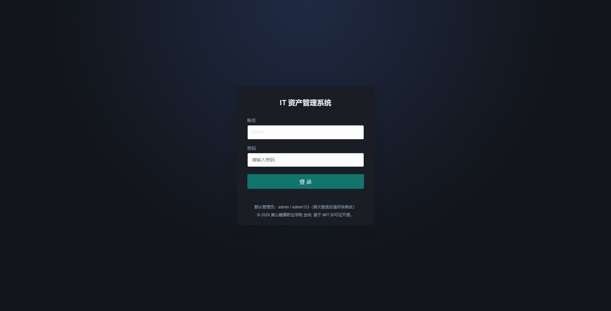
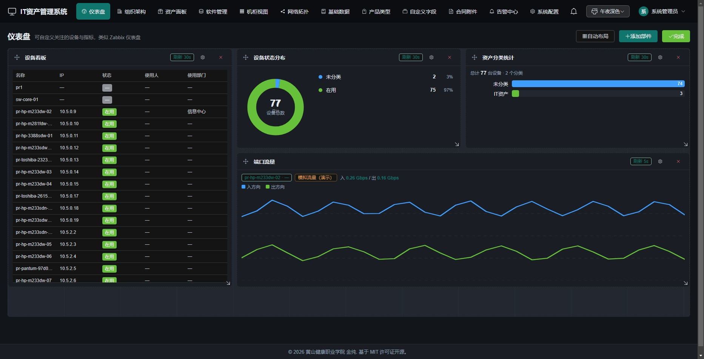
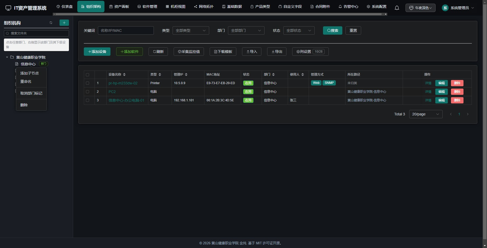
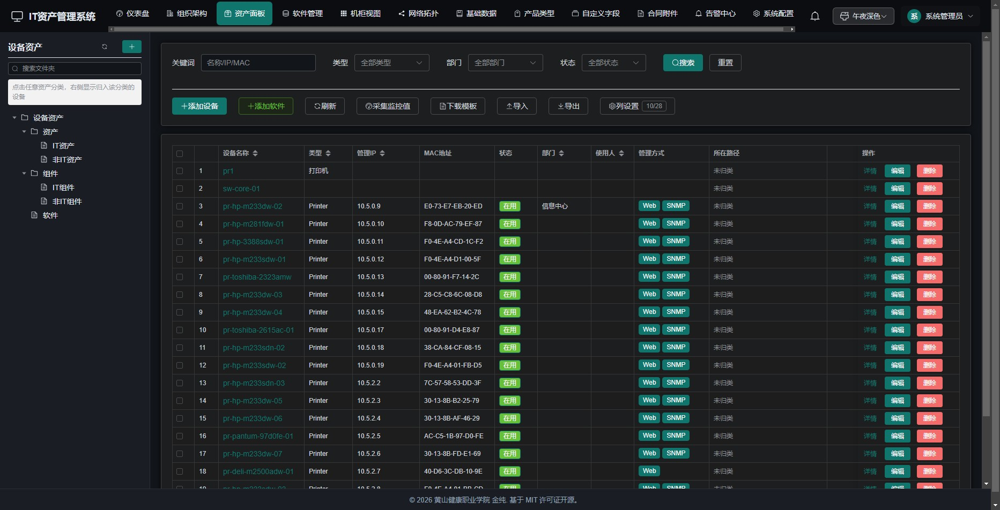
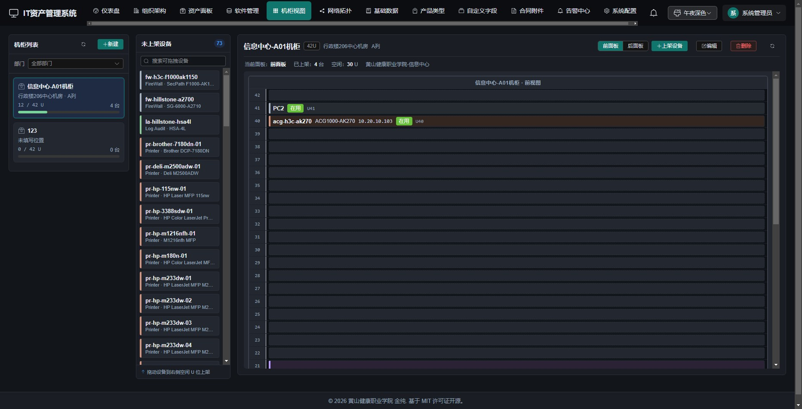
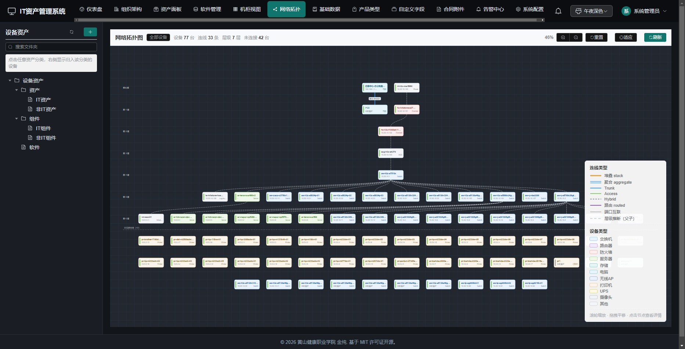
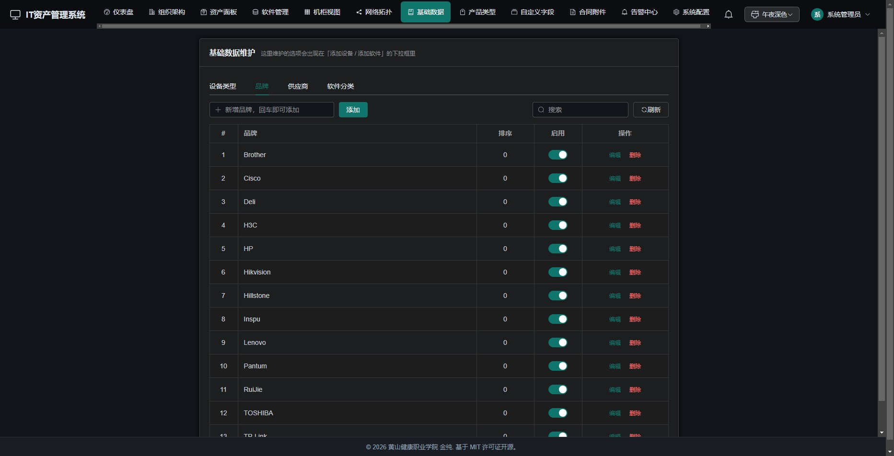
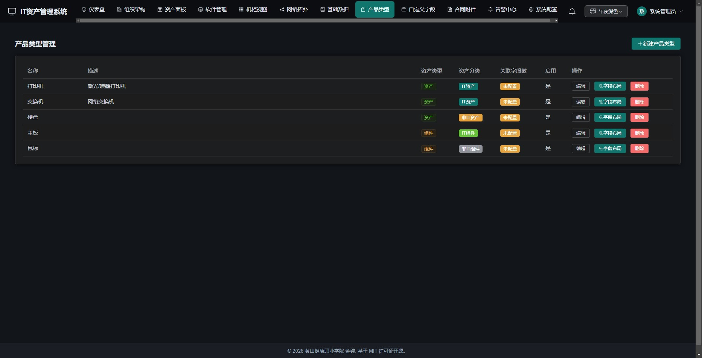
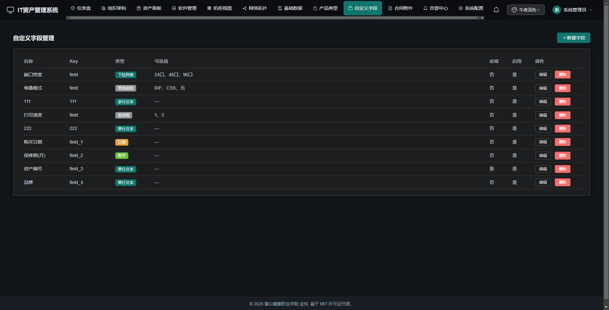
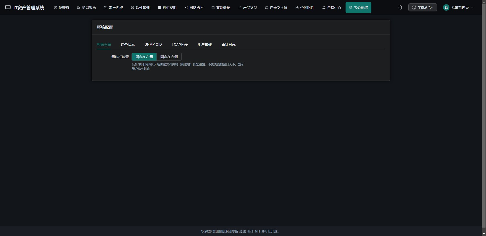

# IT 资产管理系统

一套面向中小型组织的 **IT 资产全生命周期管理平台**：统一管理网络设备、服务器、终端等资产，支持双树（组织架构 / 资产分类）归类、SNMP 监控、合同附件、导入导出与审计日志。**纯 Python + Vue 前后端分离项目，不含任何可执行文件（EXE）打包代码。**

> 适合 IT 管理员、运维人员日常登记与盘点设备，也可作为资产可视化与拓扑展示的内部工具。

---

## ✨ 功能特性

- **资产台账**：设备录入 / 编辑 / 批量操作，支持产品类型 + 自定义字段（11 种字段类型），端口按类型细分。
- **双树结构**：左侧「组织架构树」与「资产分类树」双视图，文件夹自由组织。
- **SNMP 监控**：内置采集模板（OID 配置），默认模拟数据；可切换真实采集（pysnmp）对接网络设备。
- **字典管理**：产品类型 / 品牌 / 供应商 / 软件分类统一维护。
- **软件管理**：软件台账与批量操作。
- **合同附件**：设备关联采购合同，文件落盘管理。
- **导入导出**：Excel 模板下载 → 预览校验 → 正式导入（单事务回滚）；导出含设备 / 端口 / 机柜三 Sheet。
- **告警与审计**：操作审计日志、SNMP 告警列表。
- **可视化**：仪表盘、网络拓扑视图、机柜视图。
- **权限**：管理员 / 普通用户两级，基于会话 Cookie 的登录鉴权。

---

## 📸 系统界面预览

> 以下截图均取自脱敏后的演示环境（深色主题）。

### 登录与总览
<p align="center">
  
  
</p>

### 资产管理
<p align="center">
  
  
</p>

### 可视化亮点
<p align="center">
  
  
</p>

### 字典与配置
<p align="center">
  
  
  
  
</p>

---

## 🧱 技术栈

| 层 | 技术 |
|---|---|
| 后端 | Python 3.12（兼容 3.9+，未实测）、FastAPI、SQLAlchemy 2.0、Pydantic 2、Uvicorn |
| 数据库 | SQLite（单文件，开箱即用；可扩展为多库） |
| 前端 | Vue 3、Element Plus、Vite 5、Axios |
| 采集 | 内置 SNMP 模板；真实采集依赖 `pysnmp` |

---

## 📁 项目结构

```
it-asset-system/
├── backend/                 # FastAPI 后端
│   ├── app.py               # 启动入口（执行 python app.py 即可，内部调用 uvicorn）
│   ├── app/
│   │   ├── main.py          # FastAPI 应用：路由注册、静态托管
│   │   ├── database.py      # SQLite 引擎 / Session 工厂
│   │   ├── auth.py          # 登录鉴权（pbkdf2 哈希、会话 Cookie）
│   │   ├── models.py        # ORM 模型
│   │   ├── routers/         # 业务路由（devices / folders / dictionaries / contracts / snmp / import_export ...）
│   │   └── config/          # oid_config.yaml（OID 模板）、snmp_config.json（采集开关）
│   ├── data/                # it_asset.db（SQLite，已被 .gitignore 忽略）
│   ├── init_db.py           # 可选：灌入示例数据
│   └── requirements.txt     # 运行依赖（已剔除打包库）
├── frontend/                # Vue3 前端
│   └── src/                 # 视图、组件、路由、API
├── migrate_db.py            # 数据库迁移脚本（补列 / 建表）
├── DEPLOY.md                # 部署指南（安装、初始化、启动）
├── 操作指南.md              # 操作指南（日常使用）
└── .gitignore
```

---

## 🚀 快速开始

```bash
# 1. 后端
cd backend
python -m venv venv
# Windows 激活： venv\Scripts\activate
# macOS/Linux 激活： source venv/bin/activate
pip install -r requirements.txt
python app.py                # 默认监听 http://localhost:8000

# 2. 前端（另开终端）
cd frontend
npm install
npm run dev                 # 默认 http://localhost:5173
```

浏览器打开 **http://localhost:5173/**，使用默认账号登录：

- 用户名：`admin`
- 密码：`admin123`

> ⚠️ 首次登录后请尽快修改管理员密码。详细步骤与数据库初始化见 **[DEPLOY.md](./DEPLOY.md)**。

---

## 📚 文档导航

| 文档 | 说明 |
|---|---|
| [DEPLOY.md](./DEPLOY.md) | 部署指南：环境要求、虚拟环境、依赖安装、数据库初始化、启动与访问 |
| [操作指南.md](./操作指南.md) | 操作指南：账号、资产管理、SNMP 监控、导入导出、合同、告警审计等日常使用 |
| [LICENSE](./LICENSE) | 开源许可：MIT 协议（版权归 黄山健康职业学院 金纯） |

---

## 🔒 安全说明

- 设备登录密码、SNMP 团体字等敏感字段**明文存储于数据库**，请勿将生产数据库提交到版本库（已写入 `.gitignore`）。
- 默认管理员密码仅用于首次启动，生产环境务必修改并定期轮换。
- 本项目定位为**内部资产管理工具**，未内置多租户、外部认证等生产级安全加固；对外暴露前请自行评估。

---

## 📄 License

本项目采用 **MIT 协议** 开源，版权归 **黄山健康职业学院 金纯** 所有。

完整条款见 [LICENSE](./LICENSE)。允许任意使用、修改与再分发，但须保留版权声明与许可声明。
